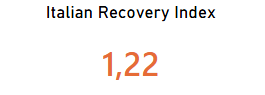
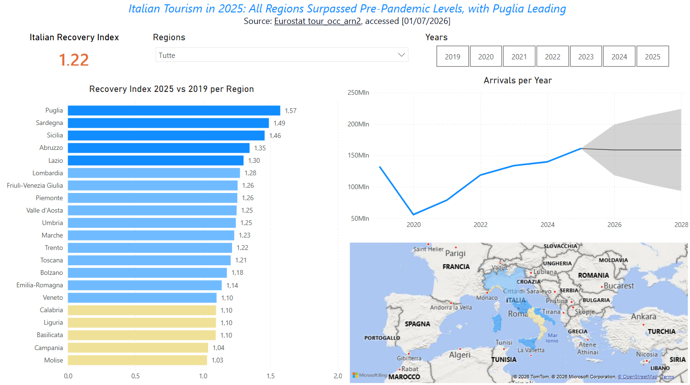

# Tourism Recovery Dashboard

A simple data analytics project focused on tourism recovery trends across Italian regions after COVID-19.

This project builds on:  
[DataSkew.io Tourism Recovery Dashboard](https://dataskew.io/projects/data-analyst-tourism-dashboard/)

The main indicators used in this project are:

- Tourist arrivals
- Recovery Index, defined as the ratio between current tourist arrivals and 2019 levels

## Headline Findings

All regions have a positive recovery index, with Puglia leading and the national average at +22%.



## Tools

- SQL
- Power BI
- DuckDB
- Git & GitHub

## Dashboard



## Findings

Italian tourism recovery has been uneven since the 2020 collapse. By 2025, all 20 regions had surpassed their 2019 baseline, with the recovery index ranging from +3% in Molise to +57% in Puglia.

Traditionally leading regions such as Toscana, Veneto, and Lombardia fall in the middle of the distribution, suggesting a relatively smaller decline during the COVID years.

Excluding the 2020 downturn, annual tourist arrivals show a relatively linear trend. Current projections estimate 180M, 200M, and 220M tourist nights for 2026–2028.

## Project Structure

```text
├── data/
├── docs/
├── ingest/
├── powerbi/
└── sql/
```

## Additional Documentation

- [Preliminary Data Check](docs/preliminary_data_check.md)
- [Implementation Notes](docs/implementation_notes.md)
- [Lessons Learned](docs/lesson_learned.md)