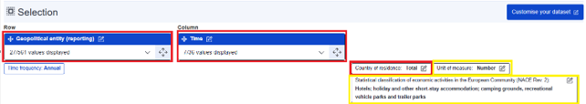
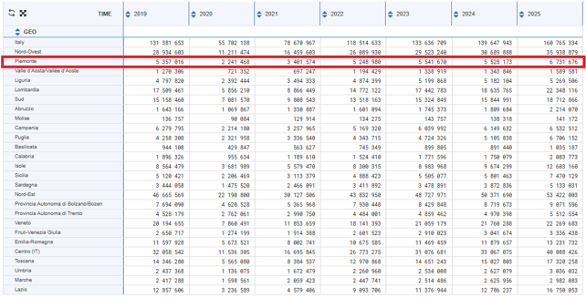
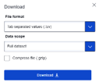
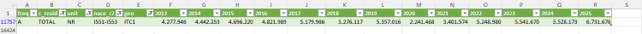
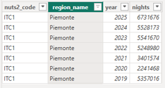

# Preliminary Data Check

Quick validation to ensure consistency of figures across project stages.

An Excel export was used as a simpler way to inspect raw CSV data.

---

## 1. Export from Web UI & Filters

Filters applied at export stage:

- Unit of Measure = NR  
- NACE_R2 = I551–I553  

Remark: these filters were explicitly added during extraction and reflected in `01_stg_tourism.sql`.  
NACE categories partially overlap, and I551–I553 represents the aggregated accommodation sector.

---

## 2. Import CSV in Excel and Check on “Piemonte”

To validate raw data more easily, CSV was imported into Excel.

Filters applied:

- c_resid = TOTAL  
- unit = NR  
- nace_r2 = I551–I553  

Sample validation:
- Piemonte, 2019 = 5.357.016 → OK

---

## 3. Power BI Final Table

In the final Power BI model, fields such as `c_resid`, `unit`, and `nace_r2` are not present explicitly, as they are already resolved in the transformation layer.

Result consistency: OK